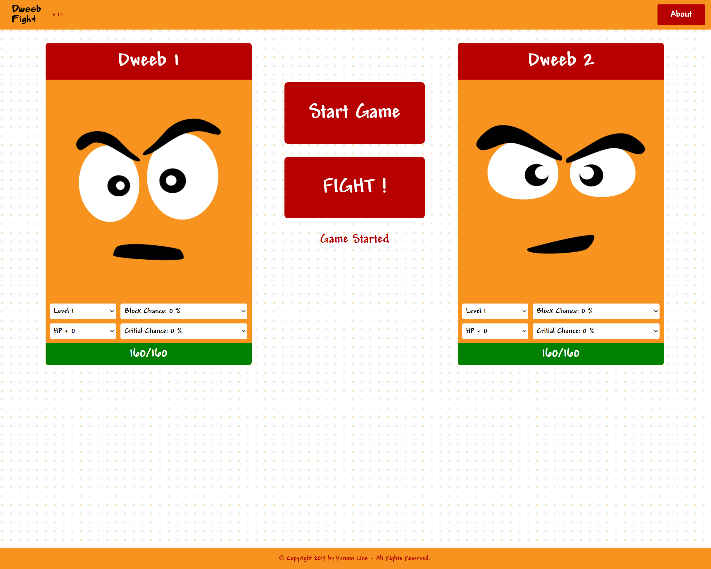

# Dweeb Fight

 Fighting mini-game with open character's attributes. [Click here](https://game-with-class-components.netlify.app) to see the app running.

 App print:

 

# Running

Simply run:

- ```$ yarn``` (for installing dependencies)
- ```$ yarn start``` (for running in dev mode)

# Playing

This game basically puts two characters into a fight, and the fight will be based on their level + attributes. You are free for changing attributes to see what happens. 

# About this app

 This application has several some coding pieces that are considered obsolete, such as using Redux core instead of Redux toolkit, and React class-based components, instead of funcion/hooks based. Also, this project doesn't reflect programming best practices I use on enterprise-level applications. The original project was created in 2019, and I made a re-upload in 2022 for updating critical code updates.


